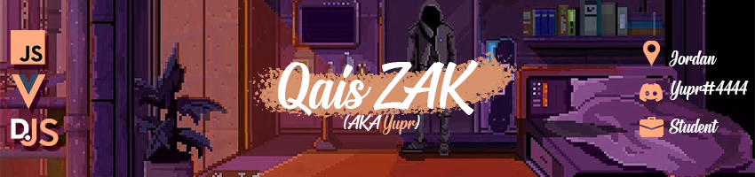

## [](https://github.com/QaisZAK)


# Merhaba! I'm <span style="color:#fdab7f"> **Qais** </span>

<br />

*Game Development and Design student at [<span style="color:#fdab7f"> **SAE** </span>](https://www.sae.edu/home3)*\
*Amateur Discord Bot Developer*\
*[SOON] Owner of **[<span style="color:#fdab7f"> **Yup** </span>](https://www.yupdev.tech)***

<br />
<br />

###  <span style="font-size:25px;align:center"> More about me...  </span>
```js
const qais = {
    fullName: "Qais Zaid Al-Kilani",
    living: "Jordan - Amman",
    student: true,
    pronouns: "He/Him",
    interests: ["Javascript", "Discord bots", "Vue/Nuxt", "Web"],
    projects: [
        {
            name: "OutsideJoke",
            roles: ["Discord Server Manager", "Twitch Moderator"],
            reference: "OutsideJokeTV on Youtube and Twitch",
            online: true
        },
        {
            name: "Yup",
            roles: ["Founder", "Lead Developer"],
            reference: "yuppdev.tech",
            online: false
        }
    ]
}
```

Would you like to connect? Hit me up on [Discord](https://www.discord.com) Yupr#4444

<br />

---
## 🎧 Listening to...
[](https://open.spotify.com/user/USER_NAME)

 [<span style="color:#fdab7f"> **My Spotify Playlists** </span>](https://spoti.fi/35UrP58)
  - [<span style="color:#d17d50"> Sad Playlist </span>](https://open.spotify.com/playlist/3h1FCDLBGMPFPSau6Cvkfn?si=d2c642b75bc14e32)
  - [<span style="color:#d17d50"> Discord Playlist </span>](https://open.spotify.com/playlist/2YVpPvGrW74BVUlU50cniI?si=3bee230a61d64e16)
  - [<span style="color:#d17d50"> Low vibes </span>](https://open.spotify.com/playlist/1VOnVFtcVXvIrKEUK5S9FZ?si=6e2017badeb4418f)

<br />

---
## 💻 Development

<br />

[](https://github.com/anuraghazra/github-readme-stats)

<br />

<details>
<summary>✅ Favorite workspaces</summary>

- Javascript
- Discord.JS
- Vue/NuxtJS
</details>

<br />

<details>
<summary>🐌 Github Actvity</summary>

<!--RECENT_ACTIVITY:start-->
1. ⭐ Starred [MadeBaruna/paimon-moe](https://github.com/MadeBaruna/paimon-moe)
2. 🤝 Became collaborator on [Yup-Dev/YupDev-API](https://github.com/Yup-Dev/YupDev-API)
3. 🔱 Forked [QaisZAK/novatorem](https://github.com/QaisZAK/novatorem) from [novatorem/novatorem](https://github.com/novatorem/novatorem)
4. 🔱 Forked [QaisZAK/WaylonWalker](https://github.com/QaisZAK/WaylonWalker) from [WaylonWalker/WaylonWalker](https://github.com/WaylonWalker/WaylonWalker)
5. 📔 Created new repository [QaisZAK/QaisZAK](https://github.com/QaisZAK/QaisZAK)
<!--RECENT_ACTIVITY:end-->

<!--RECENT_ACTIVITY:last_update-->
Last Updated: Monday, September 6th, 2021, 2:16:38 PM
<!--RECENT_ACTIVITY:last_update_end-->
</details>